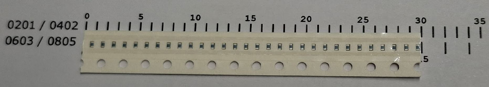
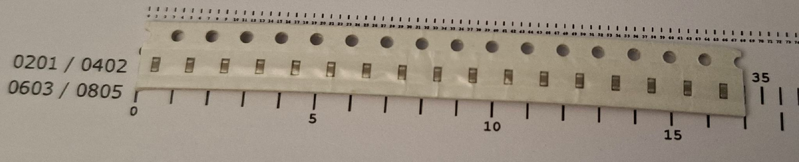
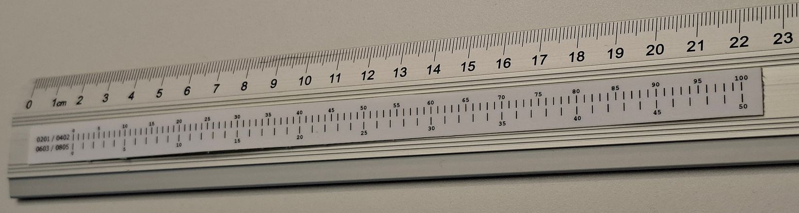

# smd-tape-reel-ruler
A ruler for measuring the number of components in a piece of reel or punched paper carier tape.

You can print this on a piece of paper, but take care to print it in scale. It should measure 20cm in total.

The ruler SVG: 

Measuring 0402: 

Measuring 0603: 

Taped on a ruler: 

